# Budget Planner Project Plan

## Project Overview

Budget Planner is a local-first desktop budget application for one household user managing multiple accounts. The project aims to deliver trustworthy transaction import, deterministic categorization, reviewable automation, and privacy-preserving budgeting workflows.

## Feature Summary

- Reliable statement import from digital text PDFs, CSVs, and manual entry
- Deterministic merchant normalization and categorization rules
- Review queue for low-confidence outcomes
- Monthly dashboards, budget targets, and simple forecasting
- Local backup and export

## Success Criteria

- Import and review workflows function end-to-end on Windows desktop.
- Critical transaction content workflows remain local by default.
- Automated tests cover parser, categorization, import-to-ledger, and desktop critical journeys.
- Representative fixtures support deterministic regression testing.
- The app remains responsive with at least 10,000 transactions.

## Key Milestones

1. Planning and governance artifacts complete
2. Domain model and schema drafted
3. Import and categorization core working
4. Desktop shell and ledger workflows working
5. Budgeting, forecasting, backup, and export working
6. Release-quality testing and verification complete

## Risk Assessment

| Risk | Impact | Mitigation |
| --- | --- | --- |
| Digital PDF variance across banks | High | Validate early with sanitized samples and bank-specific adapters |
| Native SQLite packaging friction | Medium | Lock guidance in ADR and validate packaging early on Windows |
| LLM contributor skimps on tests | High | Use CI guardrails, PR template, and issue-level AC-to-test mapping |
| Public repo accidental data leakage | High | Use sanitized fixtures, public-repo rules, and gitignored local-only paths |
| Forecast scope creep | Medium | Keep first release to simple forward projections only |

## Work Item Hierarchy

```mermaid
graph TD
    A[Epic: Foundations and LLM Delivery Scaffolding] --> A1[Feature: Planning and Governance Artifacts]
    A --> A2[Feature: Core Architecture Decisions]

    B[Epic: Transaction Ingestion and Normalization] --> B1[Feature: CSV and PDF Import]
    B --> B2[Feature: Duplicate Detection and Provenance]

    C[Epic: Categorization and Correction Workflow] --> C1[Feature: Merchant Normalization]
    C --> C2[Feature: Review Queue and Corrections]

    D[Epic: Dashboard, Budgeting, and Forecasting] --> D1[Feature: Monthly Dashboard]
    D --> D2[Feature: Monthly Targets and Forecast]

    E[Epic: Privacy, Backup, Export, and Release Quality] --> E1[Feature: Backup and Export]
    E --> E2[Feature: Verification and Quality Gates]
```

## Feature Breakdown

### Epic: Foundations and LLM Delivery Scaffolding

- Feature: Planning and governance artifacts
- Feature: ADR, glossary, and repo conventions
- Enabler: CI, PR template, and ruleset alignment
- Test: Governance validation and doc lint coverage

### Epic: Transaction Ingestion and Normalization

- Feature: Digital text PDF import
- Feature: CSV import and field mapping
- Feature: Manual entry and duplicate detection
- Enabler: Import job schema and parser adapters
- Test: Parser fixtures and import integration coverage

### Epic: Categorization and Correction Workflow

- Feature: Merchant normalization
- Feature: Rule evaluation and confidence scoring
- Feature: Review queue and correction loop
- Enabler: Rule persistence and provenance model
- Test: Categorization fixtures and regression coverage

### Epic: Dashboard, Budgeting, and Forecasting

- Feature: Monthly dashboard and ledger insights
- Feature: Monthly category targets
- Feature: Simple forward cashflow forecast
- Enabler: Aggregation queries and forecast services
- Test: Dashboard and forecast end-to-end coverage

### Epic: Privacy, Backup, Export, and Release Quality

- Feature: Backup snapshot and restore
- Feature: CSV export
- Feature: No-network verification
- Enabler: Performance harness and packaging checks
- Test: Backup/export and no-network verification suites

## Priority Guidance

- P0: Planning artifacts, schema direction, import pipeline, categorization review loop
- P1: Desktop ledger, dashboards, targets, simple forecast
- P1: Backup, export, no-network verification, release-quality automation
- P2: Niceties that improve usability but do not block first usable release

## GitHub Project Board Guidance

- Backlog
- Sprint Ready
- In Progress
- In Review
- Testing
- Done

## Definition Of Done

See the canonical DoD checklist in `docs/ways-of-work/plan/budget-planner/definition-of-ready-and-done.md`.

## Sprint Planning Assumption

- 2-week sprints
- Protect 20 percent capacity for defects and integration surprises
- Keep parser and categorization work sliced narrowly enough for deterministic validation
